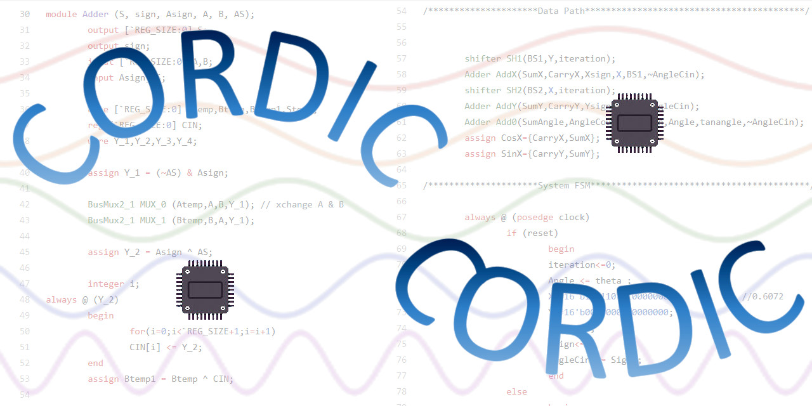

# INTRODUCTION

The **CORDIC** (COordinate Rotation Digital Computing) algorithm is a time and
space efficient algorithm mainly used for calculate the Sine and Cosine of
a given angle.  It can also be used for computing log, exponent and square
root. Common uses are sine and cosine generation, vector magnitude, polar-
cartesian conversions, and vector rotation. The CORDIC core is a
parameterized Verilog RTL code for a 16 bit fixed point CORDIC.  The input
to this system is 17 bit angle in degrees (signed magnitude representation)
and output is 17 bit sine and cosine values. The time efficiency in this
algorithm is brought about by the replacement of multiplication/division
operation by shift operation. Hence the only costly operation left is
addition.  So adders are the heart of CORDIC architecture.  

The CORDIC core uses three different adders, i.e. CLA (Carry Look-ahead
Adder), RCA (Ripple Carry Adder)and a combination of CLA and RCA. Combination
of CLA and RCA means small sets of CLAs connected through rippling carry-out
and carry-ins. All the three architectures have their area versus efficiency
trade-offs. Generally, CLA based CORDIC has minimum area but slower in speed
in comparision to other two CORDIC architectures, whereas segmented CLA based
CORDIC gives best performance with area panelty.


# APPLICATIONS

 o 16 bit fixed point arithmetic.

 o Input angle range -45 degrees to +45 degrees. 

 o Input angle value: signed magnitude representation (1 sign bit, 8 integer
   bits, 8 fractional bits).

 o Output values in 2's complement representation. 

 o Synchronous reset. 

 o Parameterized Verilog RTL code with sample synthesis script (For Synopsys
   DC). 


# INTERFACE

Verilog instantiation in oc the CORDIC would look like this.

```varilog
cordic cordicInstance (CosX,SinX,theta,Sign,clock,reset);
```

# SIGNAL DECLARATION

| Name  |  Dir   |               Description
|-------|--------|-----------------------------------------------------------------
| clock | Input  | The main system clock.  All synchronous signals are clocked  off the rising edge of clk.
| reset | Input  | An active high synchronous reset signal.
| Sign  | Input  | Sign bit for the input Angle.
| theta | Input  | 16 bit input in degrees (8 integer bits, 8 fractional bits).
| CosX  | Output | 17 bit output value (1 bit sign and 16 bit value) of Cos(theta) in 2's complement representation. Valid only after 16 clock cycle from reset goes low.
| SinX  | Output | 17 bit output value (1 bit sign and 16 bit value) of Sin(theta) in 2's complement representation. Valid only after 16 clock cycle from reset goes low.

# CONTENTS

After unzipping, you shall see the following directories and subdirectories.

```
README    : this file.
cla/      : CORDIC with carry look ahead adder.
  hdl/    : verilog RTL code.
  script/ : sample script for synthesis.
cla.rca/  : CORDIC with carry look ahead and ripple carry adder.
  hdl/    : verilog RTL code.
  script/ : sample script for synthesis.
cla/      : CORDIC with carry look ahead adder.
  hdl/    : verilog RTL code.
  script/ : sample script for synthesis.
```

# SIMULATION

file sim.txt (present under each hdl/ directory) contains the file names exactly
the order the simulator should see. For example, with verilog-XL issue the\
following commands to get the simulattion results.

```
> cd cla/hdl
> verilog -f sim.txt
```

# SYNTHESIS

see the sample script */script/syn.scr under each directory.

If you have any more questions, feel free to drop me a mail.

# HISTORY

```
v0.1a - First Draft (Nov 1997)
v0.1  - The inital release (May, 2000)
```
